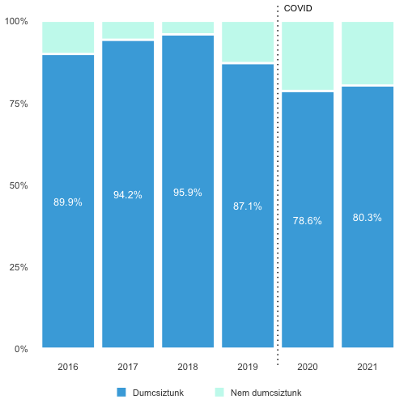
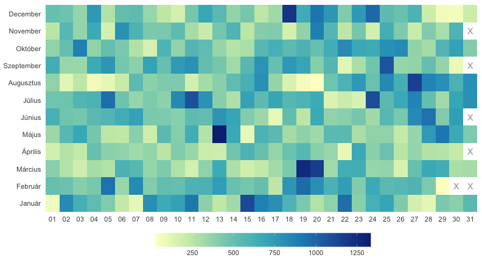
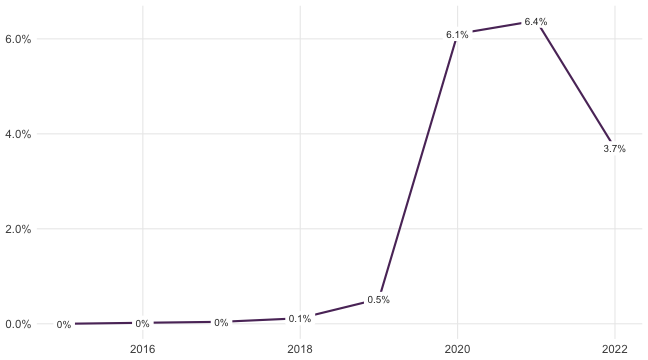
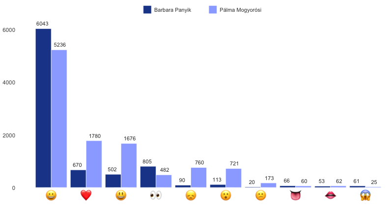
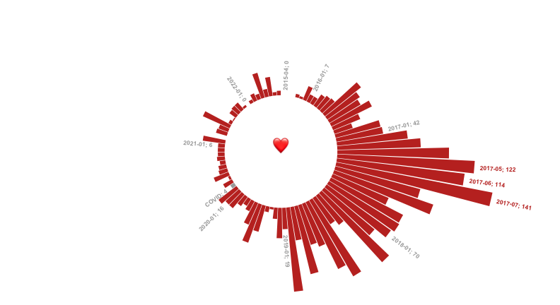
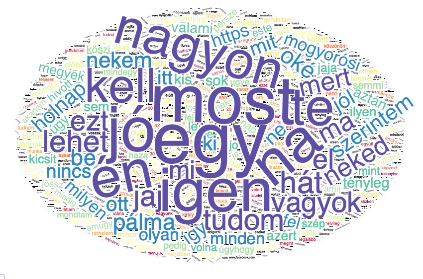

<center>
# Hogy is volt ez a Messengeren?
## Több mint 6 év üzenetváltása
</center>
<br />

### Na, lássuk...


<br />
### Mennyi üzenetet váltottunk egy nap?
*Napi üzenetmennyiség 2015.04.22. - 2022.09.17. között*


<br />
### Szerinted pötyögtünk az év minden napján?
*2016-2021 teljes évek alapján [2016 szökőév]*




<br />
### Mikor chatelünk a legtöbbet?
*Nahát! Úgy tűnik, a hónap közepén és végén jellemzően több diskurálnivalónk van, mint a hónap elején - különösen az év második felében. Ez alól kivétel a szülinapom utáni 2 nap, akkor is ment a szöveg rendesen.*
*December 18. is aktív nap: talikat szerveztünk, cukiskodtunk, és vártuk a műtéted.*
*Május 13-án is sokat szoktunk beszélni, ezt két év húzza fel, 2017 és 2018. Közös bennük, hogy mindkét nap Nyíregyre utaztál/ott voltál, én mindkét alkalommal rossz közérzetről számoltam be, és mindig cukiskodtunk. '18-ban egy közös interjúgépelős projektről is beszéltünk és még lakásokat is nézegettünk.*




<br />
### Hívások aránya
*2020-ban már annyira untuk a képernyőt, hogy inkább hívtuk egymást.*




<br />
### Milyen emojikat használunk?
*Én a szíveket, te meg a szemeket küldöd*



<br />
### "Love" emojik küldése a hónapok során
*Úgy tűnik, már a COVID előtt is lényegesen kevesebb szív emojit küldtünk az első pár évhez képest - de ne felejtsük el, hogy kevesebbet is chateltünk! Úgyhogy ez nem jelent semmit!!! <3 (Majd kiszámolom az arányokat is, jó?)*




<br />
### Szófelhő
*Jó öreg szófelhő*



<!--html_preserve--><iframe title="My embedded document" src="tmp.html" height="600" width="100%"></iframe><!--/html_preserve-->


```
## Error in parse_block(g[-1], g[1], params.src, markdown_mode): Duplicate chunk label 'setup', which has been used for the chunk:
## library(dplyr)
## library(knitr)
## library(ggplot2)
## library(tidyr)
## library(tibble)
## library(hrbrthemes)
## library(janitor)
## library(ggrepel)
## library(wordcloud)
## library(tidyverse)
## library(ggwordcloud)
## library(wordcloud2)
## library(tidytext)
## library(ggtext)
## library(webshot)
## library(htmlwidgets)
## library(htmltools)
## knitr::opts_knit$set(progress = FALSE, verbose = FALSE)
## knitr::opts_chunk$set(echo=FALSE, message=FALSE, warning=FALSE)
```

